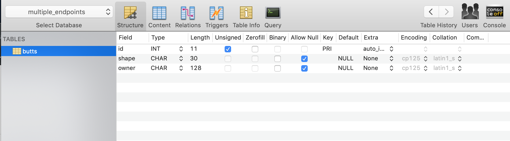
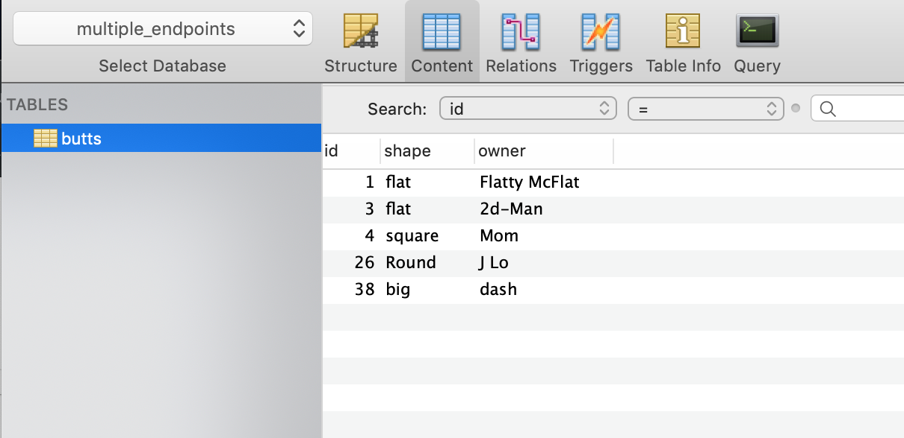
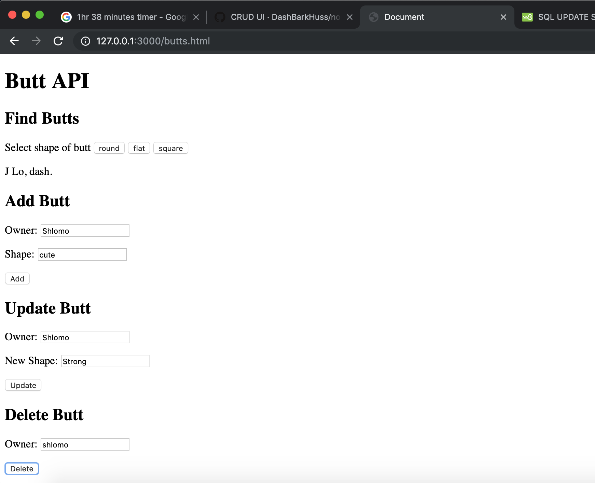

*Feel free to reach out if any of this is unclear or you want help recreating this. Whether you are a total noob, my writing is confusing, or you're coming from a different background, I'll consider adding more clarification.*

This is a simple sample app that implements CRUD. It **adds**, **finds**, **updates**, and **deletes** butts from a database. 

"*Butts*" is my go to place holder word whenever I test anything. You can replace "*butts*" with any word you like. But be forewarned: you'll no longer be able to make the pun "*grabbing flat butts*" from the database or "*this butt is undefined*".

I used mysql and node. I hosted my database on an ubuntu server on Linode. I did the $5 a month plan.

## Tables:

Here's how my table is structured:

Here's some sample content:

## UI
The UI is not pretty. It's just to show you how to connect the UI to the API.

